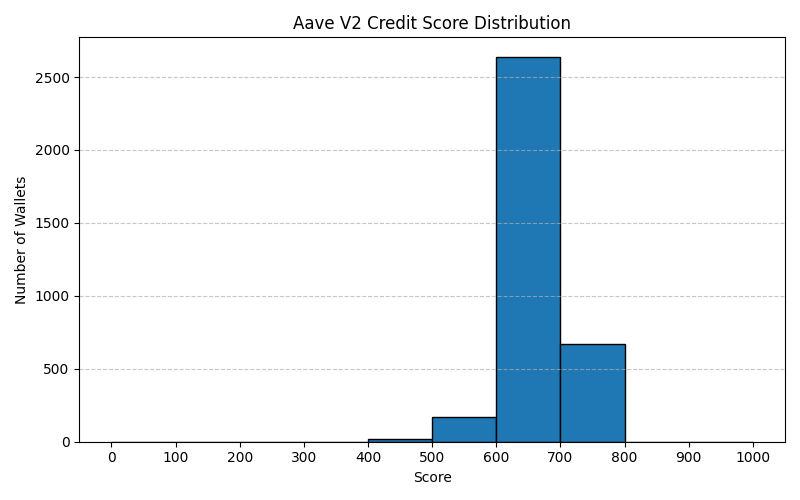

# Credit Score Analysis

## Score Distribution

_Score buckets: 0–100, 100–200, ..., 900–1000._

## Insights: Low-Range Wallets (0–400)
- Frequently liquidated
- High borrow-to-repay ratio (low repayment)
- Often borrowed more than deposited
- Limited action diversity

## Insights: High-Range Wallets (800–1000)
- Consistent repayment (repay >80% of borrowed)
- No liquidations
- Diversified usage (3+ distinct actions)
- Borrowed less than or equal to deposited

## Observations
- Most low-score wallets show risky or incomplete repayment behavior.
- High-score wallets demonstrate responsible, diversified DeFi usage.

_See `outputs/score_distribution.png` for the full distribution._ 